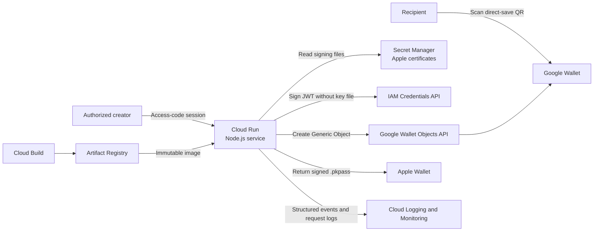

# Rotary Wallet Card Generator

## Problem Statement

Rotary members often meet people who are unfamiliar with Rotary. After learning what Rotary does, these people express interest in joining a local club — but the member then has to verbally share a lot of details: their name, contact information, club name, and meeting location and time. These details are easily forgotten, which can lead to a potential member never attending their first meeting and getting to know other members.

## Potential Solution

Instead of relying on memory, a member can hand over a digital business card (an Apple Wallet or Google Wallet pass) containing all the pertinent details. The potential member then has a permanent, easy-to-find reference on their phone.

### How This Would Work

A member logs into the card generator with an access code and fills out an HTML form with their name, contact number, meeting schedule, venue name and address, and a link to the club website. Submitting the form creates either an Apple Wallet pass or a Google Wallet card, which the member adds to their own phone.

When that member later meets an interested party, they can share the card directly: an Apple Wallet pass can be shared phone-to-phone (for example, over AirDrop), and a Google Wallet card can be shared by having the recipient scan the QR code printed on the card, which saves that same card straight to their Google Wallet.


#### Apple Pass (Back)


#### Google Pass


Clone this repository, fill in your own configuration, and deploy it to your own Google Cloud project.

## Architecture



Google authentication uses the Cloud Run service account and the IAM Credentials API. No Google service-account key is included in the container image. Apple certificates and the creator authentication secrets are mounted read-only from Secret Manager at runtime.

## Access And Cost Controls

The creator UI is not anonymous. The bare service URL redirects to `/login`, and an eight-hour signed session is required for the UI and both generation endpoints. The creator access code and session secret live in Secret Manager, never in source control.

Google card recipients do not access this service. The QR code on a generated Google card contains that card's own signed `pay.google.com` save URL, so scanning it cannot create another Wallet object or invoke a billable generation route.

Additional controls:

- Login attempts: 5 per IP per 15 minutes.
- Generation attempts: 30 per IP per 15 minutes, after authentication.
- Cloud Run minimum instances: 0.
- Cloud Run maximum instances: 1.
- Google credentials: attached service identity only; no JSON key in production.

Maximum instances limits concurrent cost exposure but is not a monetary cap. Google Cloud budgets send alerts and do not automatically stop resources. Configure a billing budget and notification channel separately in Cloud Billing.

## Prerequisites

- A Google Cloud project with billing enabled, and the `gcloud` CLI installed and authenticated.
- An approved Apple Developer account with a Pass Type ID, signing certificate, and private key.
- An approved Google Wallet issuer account (numeric Issuer ID from the Google Wallet Business Console).
- Node.js 22 for local development.

## Local Development

Copy `.env.example` to `.env` and fill in your own certificate paths, Apple identifiers, Google Wallet issuer ID, and a local creator access code and session secret, then run:

```powershell
npm ci
npm start
```

Open `http://localhost:3000`. The health endpoint is `GET /api/health`.

## One-Time Cloud Setup

Set your own values and authenticate:

```powershell
$PROJECT_ID = 'your-gcp-project-id'
$REGION = 'us-west1'
$SERVICE_ACCOUNT = 'card-signer'
$SA_EMAIL = "$SERVICE_ACCOUNT@$PROJECT_ID.iam.gserviceaccount.com"

gcloud auth login
gcloud auth application-default login
gcloud config set project $PROJECT_ID
```

Enable the required APIs:

```powershell
gcloud services enable run.googleapis.com cloudbuild.googleapis.com artifactregistry.googleapis.com iamcredentials.googleapis.com secretmanager.googleapis.com walletobjects.googleapis.com
```

Create the runtime service account. It must be registered as a developer in your Google Wallet Business Console, and needs permission to sign as itself (used to create the Google Wallet save JWT without a downloaded key):

```powershell
gcloud iam service-accounts create $SERVICE_ACCOUNT --project=$PROJECT_ID --display-name='Wallet card generator runtime'
gcloud iam service-accounts add-iam-policy-binding $SA_EMAIL --project=$PROJECT_ID --member="serviceAccount:$SA_EMAIL" --role='roles/iam.serviceAccountTokenCreator'
```

Create the required Secret Manager secrets. Adding a new version is preferable to deleting and recreating a secret when certificates or codes rotate.

```powershell
gcloud secrets create apple-pass-cert --project=$PROJECT_ID --data-file=passcert.pem
gcloud secrets create apple-pass-key --project=$PROJECT_ID --data-file=passkey.pem
gcloud secrets create apple-wwdr-cert --project=$PROJECT_ID --data-file=AppleWWDRCAG4.pem
gcloud secrets create creator-access-code --project=$PROJECT_ID --data-file=creator-access-code.txt
gcloud secrets create creator-session-secret --project=$PROJECT_ID --data-file=creator-session-secret.txt

@('apple-pass-cert', 'apple-pass-key', 'apple-wwdr-cert', 'creator-access-code', 'creator-session-secret') | ForEach-Object {
    gcloud secrets add-iam-policy-binding $_ --project=$PROJECT_ID --member="serviceAccount:$SA_EMAIL" --role='roles/secretmanager.secretAccessor'
}
```

The creator access code must be at least 12 characters and the session secret at least 32 random characters. Generate them however you like, write each to its own temporary text file for the `gcloud secrets create` commands above, then delete the temporary files. Never commit these values or pass them as command-line arguments in a shared shell history.

## Deployment

Copy `deploy_example.ps1` to `deploy.ps1` (gitignored, so your own values never get committed) and edit its default parameter values to match your project, region, service name, service account, and Cloud Run URL:

```powershell
Copy-Item deploy_example.ps1 deploy.ps1
```

The script validates `.env`, builds an immutable image via Cloud Build, deploys that image by digest, keeps Google authentication keyless, mounts the Apple and creator-authentication secrets, enforces the `0`/`1` instance limits, and verifies `/api/health`. It does not create test wallet objects.

```powershell
.\deploy.ps1
```

You can also override any value at the command line instead of editing the script:

```powershell
.\deploy.ps1 -ProjectId 'your-gcp-project-id' -Region 'us-west1' -Service 'your-service-name' -ServiceAccountEmail 'card-signer@your-gcp-project-id.iam.gserviceaccount.com' -PublicBaseUrl 'https://your-service-url.a.run.app'
```

Cloud Run assigns the service URL on first deploy. Re-run the script with `-PublicBaseUrl` set to that assigned URL so the app can build correct QR codes and Google Wallet save links.

The build upload is controlled by `.gcloudignore`; your local `.env`, certificate files, private keys, `google-key.json`, and `deploy.ps1` are all excluded.

## Usage Metrics

The application writes privacy-minimal JSON events to Cloud Logging. Events contain only `event`, `platform`, and `source`; they do not contain member names, phone numbers, venues, or website values.

| Event | Meaning | Installation proof? |
| --- | --- | --- |
| `pass_issued` | An Apple `.pkpass` was generated successfully | No; this measures download/issuance |
| `save_link_issued` | A Google object and save URL were created successfully | No; the user may abandon the Google save screen |

New Google cards use direct-save QR links, so recipient scans do not call Cloud Run and are intentionally absent from application request logs.

Use a Cloud Logging query like this to inspect the events (replace `your-service-name`):

```text
resource.type="cloud_run_revision"
resource.labels.service_name="your-service-name"
jsonPayload.event=("pass_issued" OR "save_link_issued")
```

Create log-based counter metrics for each event in Cloud Logging, then chart them in Cloud Monitoring. Useful rates include:

- Platform mix: Apple `pass_issued` versus Google `save_link_issued`.
- Generation failure rate: non-success responses for `/generate` and `/generate/google` from Cloud Run request logs.

### Measuring Actual Installs

Generation is not the same as installation. Neither platform sends a universal analytics callback to this application.

**Google Wallet:** Each generated object has an output-only `hasUsers` field set by Google. Persist the object ID when creating it, then run a scheduled job that calls `genericobject.get`. A transition to `hasUsers=true` confirms that at least one user saved the object. Because the creator and recipients save the same object, this does not reveal which person saved it, how many people saved it, or whether a recipient scan occurred.

**Apple Wallet:** Add `webServiceURL` and `authenticationToken` to each pass and implement Apple's registration, update, and unregister endpoints. Wallet registers an updatable pass after installation, so active registration records are the install proxy. Registration counts devices, not unique people, and requires securely retaining device library identifiers and push tokens.

Implementing either installation tracker introduces persistent identifiers and retention obligations. Define retention, access controls, and a privacy notice before collecting them. Until then, use the structured funnel events as aggregate, non-identifying operational metrics.

Official references:

- [Google Generic Object `hasUsers`](https://developers.google.com/wallet/reference/rest/v1/genericobject)
- [Google Add to Wallet web flow](https://developers.google.com/wallet/generic/web)
- [Apple pass registration web service](https://developer.apple.com/documentation/walletpasses/adding-a-web-service-to-update-passes)
